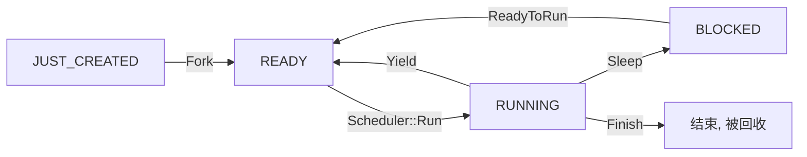

```mermaid
flowchart LR
    A[JUST_CREATED] -->|Fork| B[READY]
    B -->|Scheduler::Run| C[RUNNING]
    C -->|Yield| B
    C -->|Sleep| D[BLOCKED]
    D -->|ReadyToRun| B
    C -->|Finish| E[结束, 被回收]
```