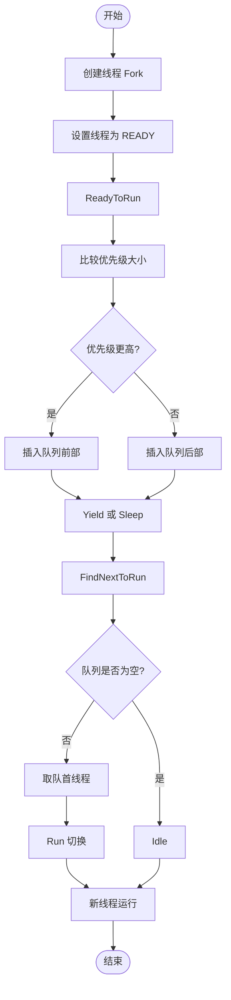

```mermaid
flowchart TD
    A([开始]) --> B[创建线程 Fork]
    B --> C[设置线程为 READY]
    C --> D[ReadyToRun]
    D --> E[比较优先级大小]
    E --> F{优先级更高?}
    F -->|是| G[插入队列前部]
    F -->|否| H[插入队列后部]
    G --> I[Yield 或 Sleep]
    H --> I
    I --> J[FindNextToRun]
    J --> K{队列是否为空?}
    K -->|是| L[Idle]
    K -->|否| M[取队首线程]
    M --> N[Run 切换]
    N --> O[新线程运行]
    L --> O
    O --> P([结束])
  
```